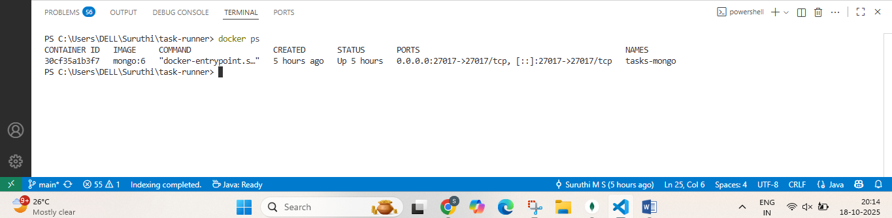
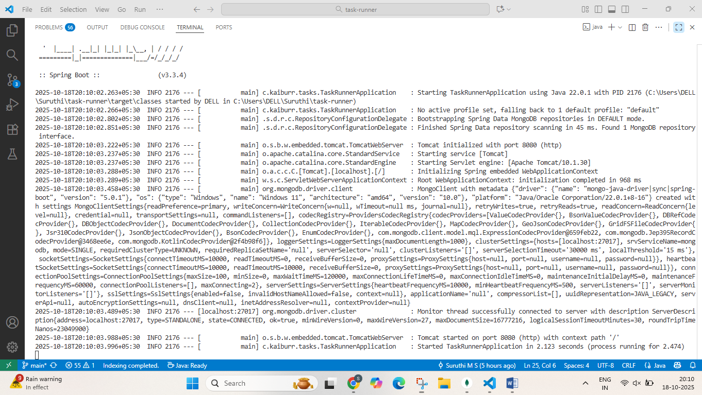
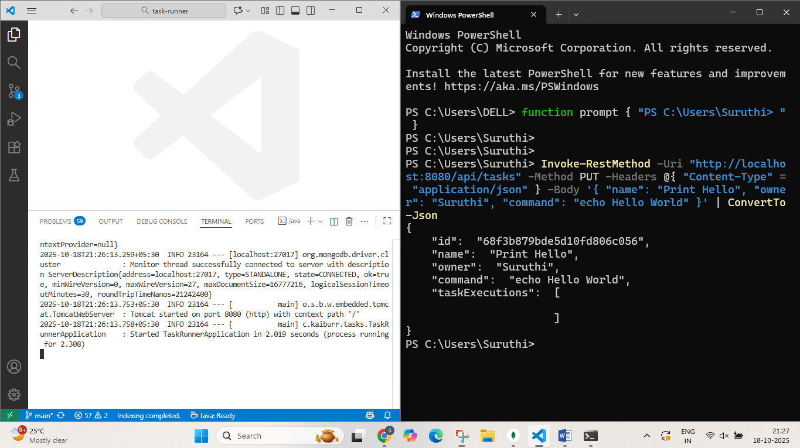
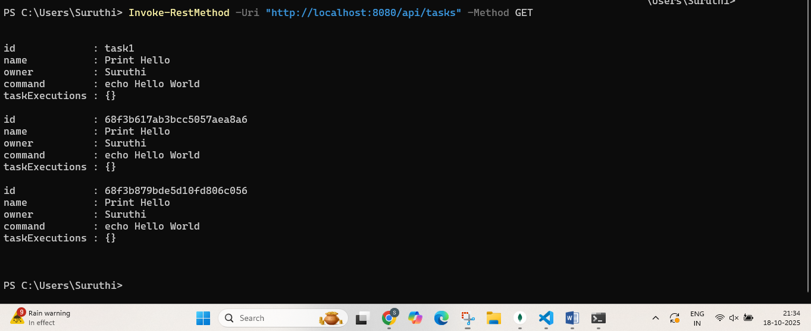
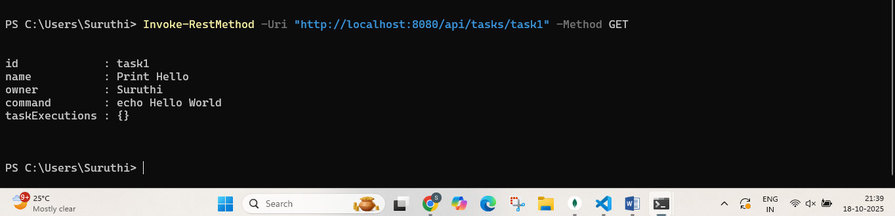
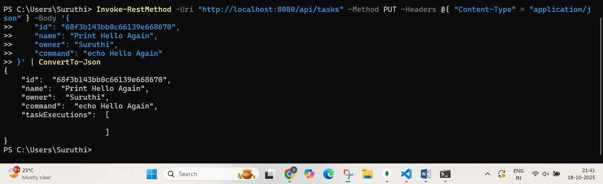
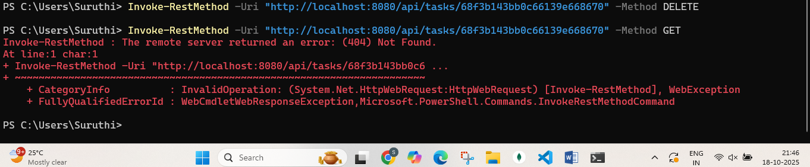
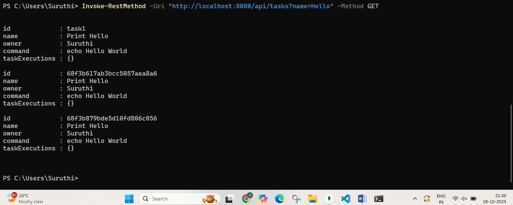
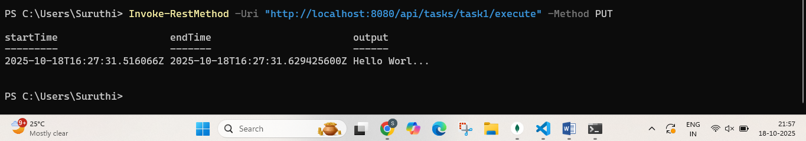
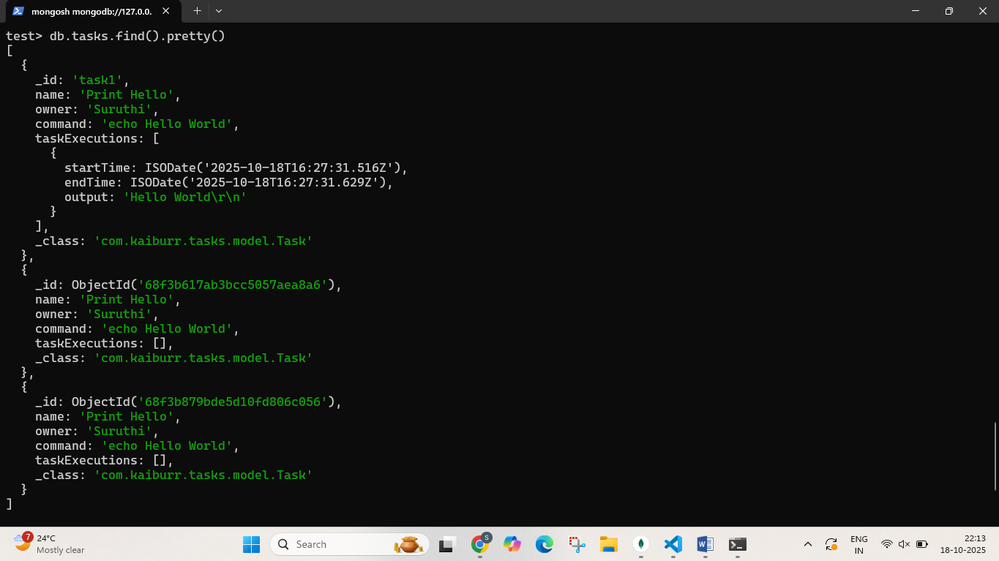

# Task 1 — Java Backend REST API

## Author
**Name:** Suruthi M S  
**GitHub:** https://github.com/Suruthinathan  
**Email:** suruthi1425@gmail.com

## **Table of Contents**
1. [Author](#author)
2. [Overview](#overview)
3. [Requirements](#requirements)
4. [Running the Application](#running-the-application)
5. [API Endpoints](#api-endpoints)
6. [Example Requests](#example-requests)
7. [Project Structure](#project-structure)
8. [Screenshots](#screenshots)

## Overview
This project implements a **Java Spring Boot REST API** for managing and executing shell-based tasks.  
Each task contains:
- `id`
- `name`
- `owner`
- `command`
- A list of past `TaskExecutions` (start time, end time, and output).

The API stores data in **MongoDB** and allows CRUD operations (Create, Read, Update, Delete), along with executing commands safely inside a controlled environment.

---

## Requirements

| Tool | Version | Purpose |
|------|----------|----------|
| **Java** | 17+ | For running the Spring Boot application |
| **Maven** | 3.8+ | To build and run the app |
| **MongoDB** | 6.x (Docker) | Database backend |
| **Postman / curl** | latest | For testing API endpoints |

---

##  Running the Application

## Step 1 — Run MongoDB in Docker

```bash
git clone https://github.com/<your-username>/<your-task1-repo-name>.git
cd <your-task1-repo-name>
````

### 2️⃣ Build the project using Maven:

```bash
mvn clean package
```

### 3️⃣ Run the Spring Boot application:

```bash
mvn spring-boot:run
```

By default, the application will start at:
 [http://localhost:8080](http://localhost:8080)

---

##  API Endpoints

| Method   | Description               |
| -------- | ------------------------- |
| `POST`   | Create a new record       |
| `GET`    | Get all records           |
| `GET`    | Get a record by ID        |
| `PUT`    | Update an existing record |
| `DELETE` | Delete a record by ID     |

---

##  Example Requests (via curl)

### Create Record

```bash
curl -X POST http://localhost:8080/api/items \
-H "Content-Type: application/json" \
-d '{"name":"Sensor Module","type":"Vibration","value":12.5}'
```

### Get All Records

```bash
curl -X GET http://localhost:8080/api/items
```

### Get by ID

```bash
curl -X GET http://localhost:8080/api/items/670f92d8c18f4a2b7f3e2a9d
```

### Update Record

```bash
curl -X PUT http://localhost:8080/api/items/670f92d8c18f4a2b7f3e2a9d \
-H "Content-Type: application/json" \
-d '{"name":"Sensor Module","type":"Acoustic","value":15.9}'
```

### Delete Record

```bash
curl -X DELETE http://localhost:8080/api/items/670f92d8c18f4a2b7f3e2a9d
```

---

##  Project Structure
```
Task1/
│
├── src/
│   ├── main/
│   │   ├── java/com/example/task1/
│   │   │   ├── controller/
│   │   │   ├── model/
│   │   │   ├── repository/
│   │   │   └── Task1Application.java
│   │   └── resources/
│   │       ├── application.properties
│   │       └── static/
│   └── test/
│
├── pom.xml
├── README.md
└── screenshots/
    ├── app_running.png
    ├── create_item.png
    └── get_all.png
```

---
## Screenshots

| Description                 | Screenshot                                  |
|-----------------------------|--------------------------------------------|
| MongoDB running             |  |
| Application running         |  |
| Create Task                 |  |
| Get All Tasks               |    |
| Get Task by ID              | |
| Update Task                 |      |
| Delete Task                 |      |
| Find Task by Name           |  |
| Execute Task                |    |
| MongoDB Data View           |    |


---

